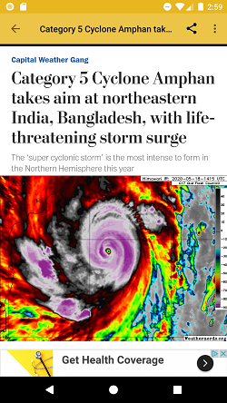
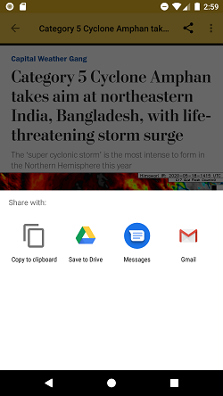

# CoverNews 
 
Application for getting and searching news! 
  
Slide through popular categories provided for particular interests like Science, Sports, Business, Travel and more. 
Powered by newsapi.org. 
• MVVM design pattern. 
•	Retrofit for interacting with RestAPIs, custom requests using OkHttp. 
•	Caching interceptor, connectivity interceptor and network interceptor for limiting number of network requests.  
•	Coroutines for asynchronous programming and threading.  
•	Tab layout, ViewPager and WebView. 
•	Kodein dependency injection library.  
 
Disclaimer: 
This app is in no way affiliated with or responsible for the content published by the included resources. 
All the content, trademarks and logos are the copyright and property of their respective owners.  
 
 

 

 

 

 

